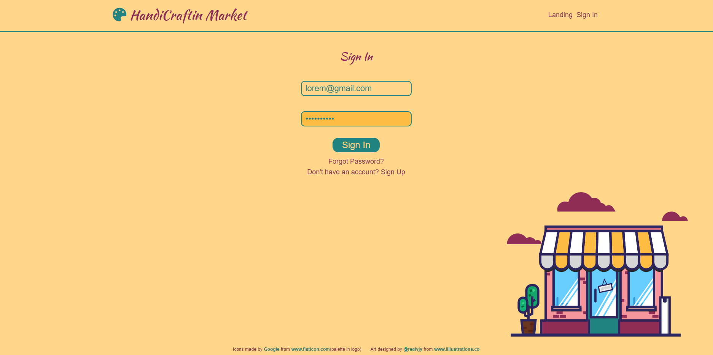
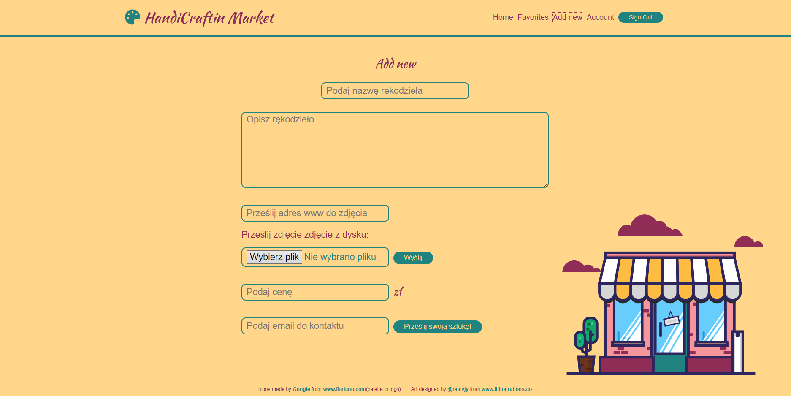
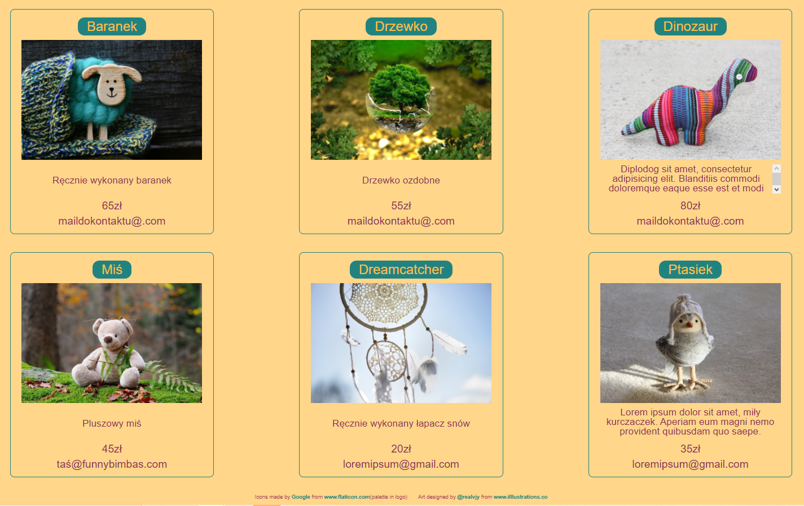

# HandiCrafti Market

## Table of contents

* [General info](#general-info)
* [Screenshots](#screenshots)
* [Technologies](#technologies)
* [Setup](#setup)
* [To do list](#to-do-list)

## _General info_

HandiCrafti Market is a virtual flea market. By using this application, the user can sell handicrafts made by him (clothing, sculptures, paintings, etc.) or make contact with other users who would like order some stuff personalized for them. Thanks to Firebase, there is an option to register, log in, grant admin rights and authorize users, reminding or changing the password. At Home, all products added by users are visible.

## _Screenshots_

## _Technologies_

* React     - version 17.0.1
* Firebase  - version 8.1.1
* Node-sass - version 4.14.1
* Node.js

## _Setup_

To run the app, first you need write npm install command to install all dependencies from package.json and then npm start to
run the app in the development mode. It will open at http: // localhost: 3000 in the browser.

## _To-do list:_

* Redux for state management.

* Cloud Firestore for user pictures.

* Adding products to favorites.

* Removal of products.

* The function of sending messages from the application.

* I have some ideas for changing the Home layout.

### This project was bootstrapped with [Create React App](https://github.com/facebook/create-react-app).
